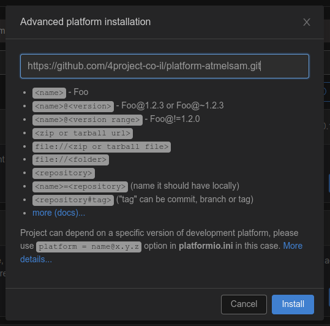

# PnP - Plug-n-Play system library
Plug-n-Play is a combination of hardware and software in the Arduino ecosystem, allowing easier and faster projects creation.

The system allows concentrating on the software logic part of the project and cancel almost entirely the hardware part, the electronics, connections configuration etc.

The Plug-n-Play library is based on the EBF - Event Based Framework library ([link](https://github.com/4project-co-il/EBF)), allowing writing the code for your project with easy, mixing different code exaples without struggle (try combining Arduino's blink and reading a button examples and you'll know what I mean), transparent utilization of the interrupts and power saving modes.

The Plug-n-Play system (both hardware and software) solves several problems:
* **Zero soldering**\
Tightening a screw is the maximum needed for a connection to some of the modules.
* **Solid and polarized connections between the parts**\
Projects could be used not only for education, but for production as well.
* **All connectors are equal**\
Any connector is ok for any module. No more thinking if you should connect a module to an analog IN, PWM out or I2C or UART port.
* **No electronics definitions or hardware related configuration**\
No more GPIO port numbers or I2C addresses. No need to solder or cut a trace to have multiple I2C modules with the same address.
* **Scalability for growing projects**\
Need 5 UARTs for your project? Just connect 5 UART modules. Need 2 more? Connect 2 more UART modules.
* **Functional thinking and not in electronic terms**\
Think turning a LED ON instead of setting a digital output high or PWM.
* **Flexible power supply**\
Modular power distribution connection. Choose the needed connection type (Screw terminal, XT30, barrel jack, USB-C PD...). Change regulators when needed (power down buck or power up boost).
* **Development and production thinking**\
Mounting holes, connectors allowing panel mounting when needed.
* **Transparent usage of interrupts**\
All the modules are using interrupts transparently to the user. Providing better responsiveness and allowing power saving modes.
* **Transparent support for power saving modes**\
Up to 25uA in deep sleep on PnP SAMD21 Development board. Almost full year on a single CR2032 coin cell battery.
* **Based on the EBF - Event Based Framework library**\
EBF is supplying the needed code infrastructure.
* **C++ Classes for Arduino environment for every module, providing their functionality**\
No more need to search for an external library that supports the module you need. Everything is included in the Plug-n-Play library.

# Installation
We use [PlatformIO](https://platformio.org/) to develop the PnP library, but try to keep it compatible with the [Arduino IDE](https://www.arduino.cc/en/software/) (that's the reason for the strange directory tree).

Since Plug-n-Play system consists of both hardware and software, 2 installation steps are required - one to install support for the Plug-n-Play development boards and another to install the Plug-n-Play library.

## Hardware support installation
### Arduino IDE
Assuming you already have the Arduino IDE installed.
If not, you can follow any good tutorial, here is [a SparkFun tutorial](https://learn.sparkfun.com/tutorials/installing-arduino-ide/all) as an example.

As described in [this tutorial](https://learn.sparkfun.com/tutorials/samd21-minidev-breakout-hookup-guide/setting-up-arduino), you need to add a line to the **Additional Board Manager URLs** field in **File** > **Preferences** menu.
Click on the 2-windows icon located on the right of that field, a window with text box will appear.
Add a new line with the following location to that text box:
```
https://raw.githubusercontent.com/4project-co-il/Arduino-core/main/Arduino-IDE/package_4project_index.json
```


Press OK to close the text box dialog and OK to close the **Preferences** window.

The rest is similar to the tutorial.
In the **Board Manager** search for `Plug-n-Play`, and you will find there an option to install the **4Project.co.il SAMD Boards**, which will include the support for the Plug-n-Play boards.\


Press **INSTALL** button to complete the installation.

### PlatformIO
We strongly suggest to use VSCode with PlatformIO environment to experience a more professional build environment compared to the Arduino IDE.\
VSCode provides you with a very professional IDE that speeds up your coding experience.\
PlatformIO is a VSCode plugin that provides compilation and programming of development boards in a similar way as it's done in Arduino IDE (buttons to compile and upload to the board).

Assuming you have already the VSCode and PlatformIO installed. There are many tutorials online.

PlatformIO have a built-in support for many popular boards. In order to use a custom board, such as Plug-n-Play SAMD21 Development board in our case, installation of a custom platform is required.

Click the "Alien" icon to get to the PlatformIO menus. Click on the **Platforms** icon (1) and click the **Advanced Installation** button (2):


Advanced platform installation window will open, asking to specify the location of the platform you want to install.\
Copy and paste the following string to the window:
```
https://github.com/4project-co-il/platform-atmelsam.git
```


Press **Install** button to complete the installation.

## Library installation
The Plug-n-Play is listed in the library managers of both Arduino IDE and PlatformIO environments. You can install it using the platform library manager (the preferred way), or if you need a specific version of the PnP, or can't wait for the library managers to be updated, you can manually install the library from current repository, as explained below.

### Arduino IDE
In Arduino IDE, go to **Tools** > **Manage Libraries...** menu. The **Library Manager** window to open with the list of all available libraries.

Type `PlugAndPlay` in the **Filter your search...** field. The list will show matching libraries for that search, in our case the Plug-n-Play library and possible other libraries with similar name as well:\


Press the **Install** button to install the Plug-n-Play library.

The IDE will show a popup window, asking if you would like to install additional libraries that Plug-n-Play is depended on (such as EventBasedFramework):\


Press **INSTALL ALL** in order to install all the dependencies.

After the installation, you will find multiple examples in the Arduino's IDE **File** > **Examples** > **PlugAndPlay** menu. You might need to scroll down the list in the **Examples** menu to find the **PlugAndPlay** entry.

Library installed using that method is available for all the projects on that computer.

### PlatformIO
Click the "Alien" icon to get to the PlatformIO menus. Click on the **Libraries** icon and type `PlugAndPlay` in the **Search libraries...** field in the Libraries Registry screen.\
Click on the magnifier glass icon to perform the search or press Enter.\
The list show the **PlugAndPlay** entry and possible other libraries with similar name as well. Click on it's blue name:\


The screen will show the selected library information with examples and some code.\
You will see the latest version of the library (you can change what version to install). Press the **Add to Project** button.\
Another window will open showing the selected version in the first field and ask you to select the project where you would like to add the Plug-n-Play library.\


Click the **Add** button to complete the installation.

In PlatformIO there is a separation between the projects, so the Plug-n-Play library will be installed to a specific project only.

You can start using the examples for the PnP after the installation.\
Pay attention that all the examples are with `.ino` extension file, as required by the Arduino IDE.\
You can simply copy and paste the relevant pieces of code to your `main.cpp` file, or other `.cpp` file in your project's `src` directory.

### Manual library installation
Manual installation of the Plug-n-Play library to both Arduino IDE and PlatformIO environments is similar. Download this repository content as a ZIP file (Click on the green "<> Code" button on the top of GitHub's page and "Download ZIP" from the menu),
and extract the ZIP content into your environment's library directory. Change the extracted directory name from "PlugAndPlay-master" to "PlugAndPlay" to make it more readable.

For **PlatformIO** on Linux system:
```
[Your PlatformIO path]/Projects/[Your project name]/lib/
```
For **Arduino 1.6.x and up** on Linux system:
```
~/Arduino/libraries/
```

# Examples
Multiple examples are ready for you in the [examples](https://github.com/4project-co-il/PlugAndPlay/tree/master/examples) directory.

# Bugs and requests
Please submit bug reports and requests for new features via [GitHub's Issues](https://github.com/4project-co-il/PlugAndPlay/issues) system

