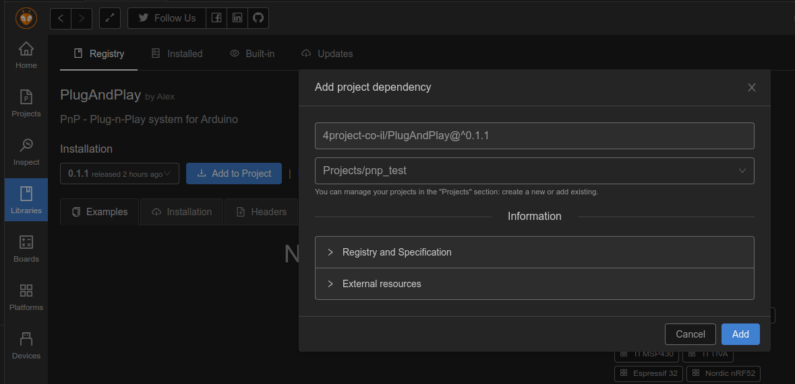

# PnP - Plug-n-Play library
Plug-n-Play is a combination of hardware and software (this library) in the Arduino ecosystem, allowing to easy and speed up projects creation.

The system allows concentrating on the software part of the project and cancel almost entirely the hardware part, the electronics, connections configuration etc.

The Plug-n-Play library is based on the EBF - Event Based Framework library ([link](https://github.com/4project-co-il/EBF)), allowing writing the code for your project with easy, mixing different code exaples without struggle (try combining Arduino's blink and reading a button examples and you'll know what I mean), faster development while concentrating on the project's logic instead on the environment.

The Plug-n-Play system (both hardware and software) solves several problems:
* Zero soldering. Tightening a screw is the maximum needed.
* Solid and polarized connections between the parts, so the projects could serve not only for education, but for production as well.
* All connectors are equal. Any connector is ok for any module. No more thinking if you should connect a module to an analog IN, PWM out or I2C port.
* No electronics definitions or hardware related configuration (no GPIO port numbers or I2C addresses).
* Scalability for growing projects. Need 5 UARTs for your project? Just connect 5 UART modules.
* Functional thinking and not in electronic terms (Turn LED ON and not set digital output high or PWM).
* Flexible power supply. Modular power distribution connection with replaceable regulator.
* Deverlopment and production thinking. Mounting holes, connectors allowing panel mounting when needed.
* Transparent for the user usage of interrupts for all the modules. Allows power saving and better responsiveness.
* Transparent support for power saving modes. Up to 25uA in deep sleep on PnP SAMD21 Development board.
* Based on the EBF - Event Based Framework library, supplying the needed code infrastructure.
* C++ Classes for Arduino environment for every module, providing their functionality. No more need to look for external library.

# Installation
We use PlatformIO to develop the PnP library, but try to keep it compatible with the Arduino IDE (that's the reason for the strange directory tree).

The PlugAndPlay is listed in the library managers of both platforms. You can install it using the platform library manager (the preferred way), or if you need a specific version of the PnP, or can't wait for the library managers to be updated, you can manually install the library from current repository, as explained below.

## Library managers
### Arduino IDE
In Arduino IDE, go to **Tools** > **Manage Libraries...** menu. Wait few seconds for the **Library Manager** window to open with the list of all available libraries.

Type `PlugAndPlay` in the **Filter your search...** field. The list will show matching libraries for that search, in our case:


Press the **Install** button to install the Plug-n-Play library.

After the installation, you will find multiple examples in the Arduino's IDE **File** > **Examples** > **PlugAndPlay** menu. You might need to scroll down the list in the **Examples** menu to find the **PlugAndPlay** entry.

Library installed using that method is available for all the projects on that computer.

### PlatformIO
Click the "Alien" icon to get to the PlatformIO menus. Click on the **Libraries** icon and type `PlugAndPlay` in the **Search libraries...** field in the Libraries Registry screen.\
Click on the magnifier glass icon to perform the search or press Enter.\
The list show the **PlugAndPlay** entry and possible other libraries with similar name as well. Click on it's blue name:


The screen will show the selected library information with examples and some code.\
You will see the latest version of the library (you can change what version to install). Press the **Add to Project** button.\
Another window will open showing the selected version in the first field and ask you to select the project where you would like to add the PlugAndPlay library.


Click the **Add** button to complete the installation.

In PlatformIO there is a separation between the projects, so the Plug-n-Play library will be installed to a specific project only.

You can start using the examples for the PnP after the installation.\
Pay attention that all the examples are with `.ino` extension file, as required in Arduino IDE.\
You can simply copy and paste the relevant pieces of code to your `main.cpp` file, or other `.cpp` file in your project's `src` directory.

## Manual installation
Manual installation of the Plug-n-Play library to both Arduino IDE and PlatformIO environments is similar. Download this repository content as a ZIP file (Click on the green "<> Code" button on the top of GitHub's page and "Download ZIP" from the menu),
and extract the ZIP content into your environment's library directory. Change the extracted directory name from "PlugAndPlay-master" to "PlugAndPlay" or "PnP" to make it more readable.

For **PlatformIO** on Linux system:
```
[Your PlatformIO path]/Projects/[Your project name]/lib/
```
For **Arduino 1.6.x and up** on Linux system:
```
~/Arduino/libraries/
```

# Examples
Multiple examples are ready for you in the [examples](https://github.com/4project-co-il/PlugAndPlay/tree/master/examples) directory.

# Bugs and requests
Please submit bug reports and requests for new features via [GitHub's Issues](https://github.com/4project-co-il/PlugAndPlay/issues) system

